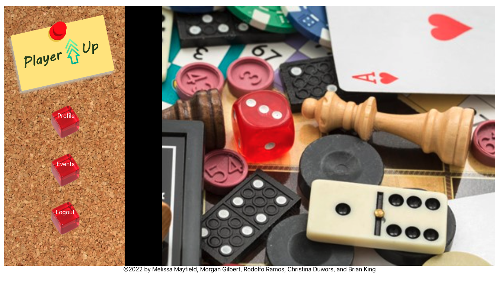

# Player UP!

## Description

Player UP is a social application designed to organize people with a similar interest - in this case games of all kinds!  A user can signup for a user account. When logged in they can browse local activities that are available to sign up to participate in, sign up for activities, and add an event for others to join. 

This is a MERN stack application composed of a REACT front end, MongoDB database, and Node.js/Express.js server and API with a GraphQL API built with Apollo Server.   

View the Deployed site here: 

## Table of Contents

- [Installation](#installation)
- [Usage](#usage)
- [Issues](#issues)
- [License](#license)
- [Contributing](#contributing)
- [Questions](#questions)
- [Images](#images)

## Installation

## Usage

User Story: 

AS individuals who love group games, 

WE want to create a website to find new friends to play with, 

SO THAT we can create “events” and “RSVP” to attend.

## Issues

## License

This project is not currently licensed.

## Contributing

This was a joint project of:
- Melissa Mayfield, 
- Morgan Gilbert, 
- Rodolfo Ramos, 
- Christina Duwors, and 
- Brian King

## Questions

See more details at https://github.com/Mayfieldmel/player-up or contact __.

## Images

Home Page:

